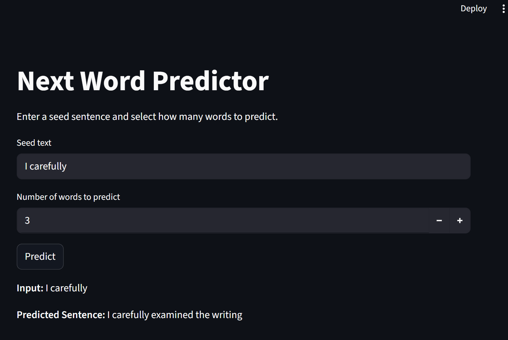

# Next Word Prediction using LSTM

This repository provides a complete solution for performing Next Word Prediction using a Long Short-Term Memory (LSTM) neural network. The model is trained on the classic literary text The Adventures of Sherlock Holmes by Sir Arthur Conan Doyle.

## 📸 Screenshot




The project includes:
* 📦 **Model building and training** using TensorFlow/Keras
* 🧠 **Preprocessing and padding** of input text
* 🌐 An interactive **Streamlit web app** for live next word prediction
* 🔤 **Sequential text generation** based on learned language patterns

---

## 📁 Project Folder Structure
```bash
📦sherlock-next-word/
├── experiments.ipynb       # Training notebook
├── app.py                  # Streamlit app for live prediction
├── next_word_lstm.h5       # Trained LSTM model
├── requirements.txt        # Python dependencies
├── README.md               # Project documentation
└── tokenizer.pickle        # Saved tokenizer for input processing
```

## 🧠 Model Overview

* **Dataset**: Sherlock Holmes Text Dataset
* **Architecture**:
    * Embedding Layer (100 dimensions)
    * LSTM Layer (150 units, ReLU activation)
    * Dropout Layer(dropout_ratio = 0.2)
    * Dense Output Layer (Softmax activation)
* **Task**: Next Word Prediction (given a seed text, predict the next N words)

---

## 🌐 Web App – Next Word Predictor

The Streamlit app allows users to:
* Enter a custom input text prompt (seed text)
* Instantly generate and display the next set of predicted words
* Explore how the model completes Sherlock Holmes-style text


---

## 💾 Setup Instructions

### Clone the Repository
```bash
git clone https://github.com/Kaustubh-Pareek/SherlockNext.git
```

### Set up a Virtual Environment
```bash
# Create virtual env
python -m venv venv

# Activate on Unix or Mac
source venv/bin/activate

# Activate on Windows
venv\Scripts\activate
```

## Install Dependencies
```bash
pip install -r requirements.txt
```

### Run the Streamlit App
```bash
streamlit run app.py
```

## 📚 Dataset

The Sherlock Holmes text dataset used here is sourced from (https://sherlock-holm.es/ascii/).  
It contains classic Sherlock Holmes stories by Sir Arthur Conan Doyle, used to train the LSTM model for next word prediction.

- Contains thousands of sentences from Sherlock Holmes novels
- Text is cleaned, tokenized, and converted into sequences for training
- Used to build a character-driven language model for generating coherent Sherlock-style text continuations


## ✨ Key Features

- Clean and modular implementation with TensorFlow/Keras
- Simple and interpretable LSTM architecture for next word prediction
- Trained on classic Sherlock Holmes stories for stylistic text generation
- Interactive Streamlit UI for real-time next word suggestions
- Easily extendable to other architectures like GRU or Transformer


## 🌐 Live Demo

You're welcome to explore the app by visiting the link provided below.

👉 [Try Yourself](https://imdb-sentiment-classifier-kaowhvyzkasbhy2vuhlcmp.streamlit.app/)